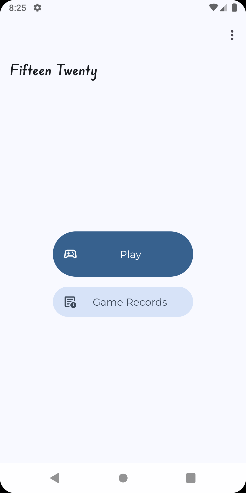
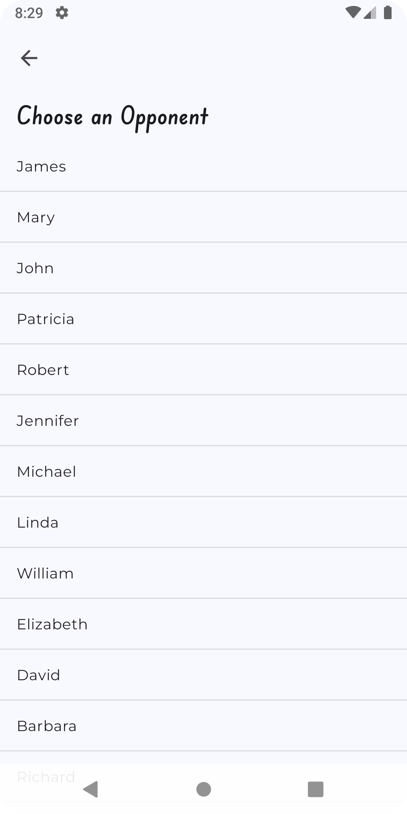
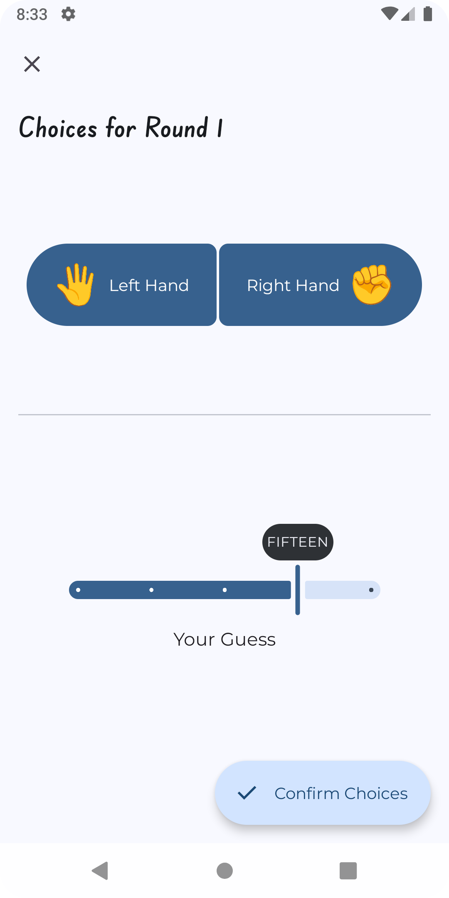
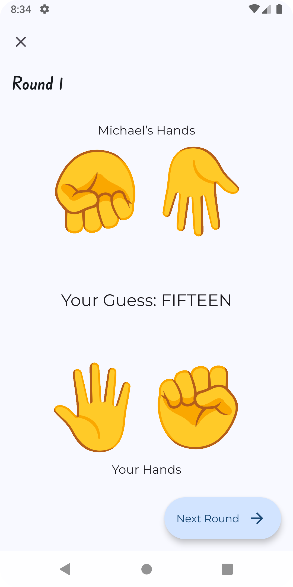
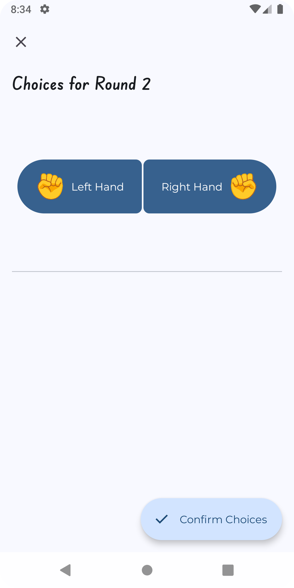
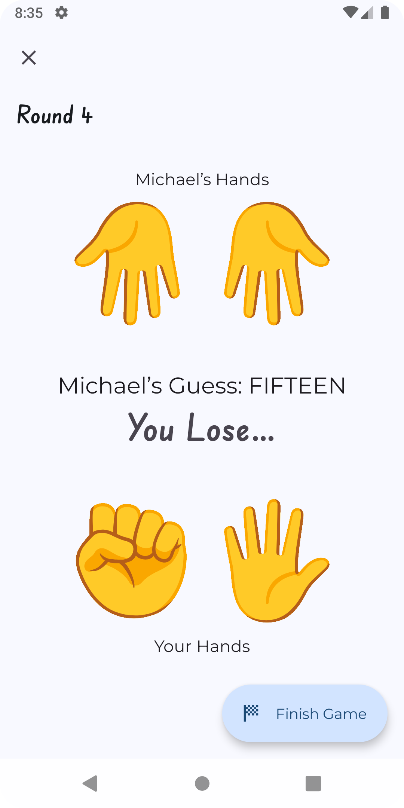
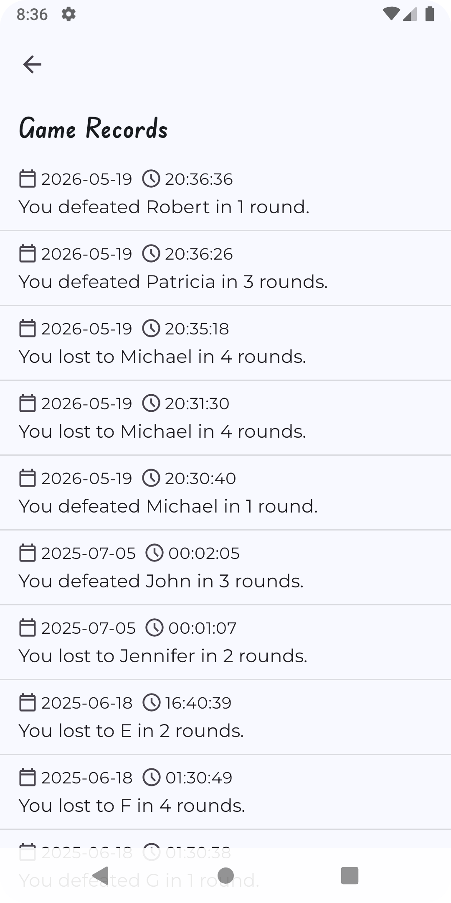
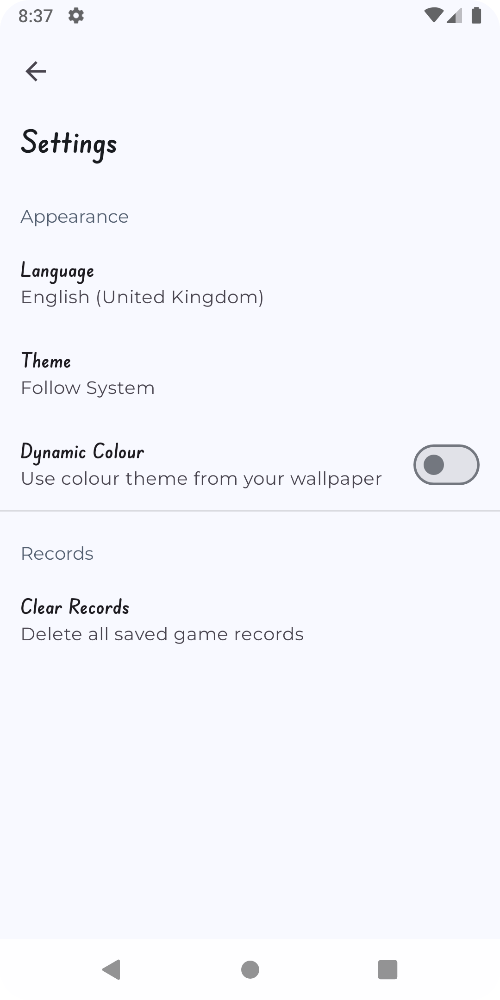

# ITP4501 Assignment

This project is an Android application developed for the ITP4501 Programming Techniques for Mobile Systems module. It implements a &ldquo;15,20&rdquo; game where players select opponents from a server, play turn-based rounds, and view their game records stored in a local database. The app is built with Android widgets and follows the assignment requirements for UI design, database handling, and server communication.

## Screenshots

<table>
    <tr>
        <th scope="col" style="width: 50%">Home</th>
        <th scope="col" style="width: 50%">Opponent Chooser</th>
    </tr>
    <tr>
        <td>
            
        </td>
        <td>
            
        </td>
    </tr>
</table>

<table>
    <tr>
        <th scope="col" style="width: 50%">Game Choices (Player&rsquo;s Round)</th>
        <th scope="col" style="width: 50%">Game Round</th>
    </tr>
    <tr>
        <td>
            
        </td>
        <td>
            
        </td>
    </tr>
</table>

<table>
    <tr>
        <th scope="col" style="width: 50%">Game Choices (Opponent&rsquo;s Round)</th>
        <th scope="col" style="width: 50%">Game Round (End)</th>
    </tr>
    <tr>
        <td>
            
        </td>
        <td>
            
        </td>
    </tr>
</table>

<table>
    <tr>
        <th scope="col" style="width: 50%">Records</th>
        <th scope="col" style="width: 50%">Settings</th>
    </tr>
    <tr>
        <td>
            
        </td>
        <td>
            
        </td>
    </tr>
</table>
